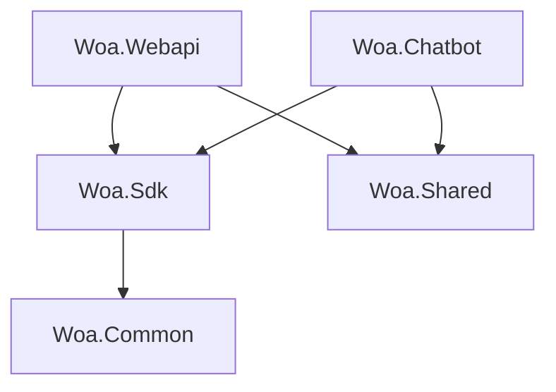

Woa（Wechat Official Account）是一个基于.net 7开发的微信公众平台接口项目，利用Supabase作为数据存储和消息通信服务，同时提供了ChatGPT和Claude2等目前热门的生成式AI会话功能接入。

### 项目结构



- **Woa.Webapi：** 微信公众平台接口及其他WebApi接口。
- **Woa.Chatbot：** 聊天机器人，提供Chat GPT、Claude2等聊天机器人接入。项目类型为Worker Service。
- **Woa.Sdk：** 微信公众平台、OpenAI、Claude接口Api封装。
- **Woa.Common：** 公共基础类库。

Chatbot的代码为何要分离出来呢？当然是为了异地单独部署咯！备案（国内服务器）和访问OpenAI，**只能选一个**。

## 运行和部署

### 开通及配置公众号

通过Woa的名称可以看出来，这是一个专门为微信公众号准备的项目，那要完整的运行项目，那我们得：

#### 1. 申请开通公众号

关于如何开通公众号，网上已经有很详细的教程了，本篇文章里不再赘述，主要是因为说来说去无非就是其他人已经写好的内容复制过来。

公众号开通之后，需要配置服务器地址（微信公众平台向接口发送的消息全部都是通过这个接口的），请求令牌（Token，用于服务端接口鉴别消息是否来自腾讯服务器），开发者Id等等。

正式的公众号并不是所有接口都能使用的，根据账号类型、认证状态的不同，公众号的接口权限也不一样，为了方便接口对接调试，我们还需要同时开通公众平台测试账号。测试账号的所有接口权限都是开通的。

#### 2. 准备域名

既然是开发公众号接口，一个可用的域名当然是必不可少的，国内的域名注册商有很多，例如时代互联、贝锐、阿里云、腾讯云等等，注册过程比较简单。

#### 3. 内网穿透工具

开发过程中需要不断地进行调试，作为一名正常的程序员，我们不可能每次更改都要打包发布到公网服务器进行测试，即麻烦也不靠谱，最好的办法就是使用内网穿透，把微信服务的请求映射到我们自己的电脑上。

实现内网穿透的工具很多，例如GoProxy，ngrok等等，然而这两者都需要自己搭建一台服务器，实施过程也比较麻烦。我推荐的方案是使用natapp（官网地址：https://natapp.cn/），NATAPP提供免费隧道和收费隧道两种，并且可以自己注册固定的二级域名。

### 准备Supabase服务

#### 1. 注册Supabase账号

Supabase账号注册比较简单，打开官网（https://supabase.com/）点击右上角Sign in按钮进入到登录界面，然后点击[Sign Up Now](https://supabase.com/dashboard/sign-up)并且填写好邮箱、密码提交注册即可。别忘了到邮箱里面查看一下supabase发送的账号激活邮件。

#### 2. 创建项目

使用第一步注册的邮箱登录到官网，在dashboard页面点击New project。在创建新项目页面填写好相关的信息后点击Create new project。Supabase云服务的服务器提供商是AWS，目前可供选择的亚洲节点只有孟买、新加坡、东京和首尔，我选择的是新加坡节点，别问为什么，问就是我乐意……


创建成功后，浏览器会自动跳转到项目概览页面，如下图：


supabase 基于 PostgreSQL 数据库，因此当你创建完项目后，就自动为你分配好了一个可访问的 PostgreSQL 数据库，你完全可以将其当做一个远程的 PostgreSQL 数据主机。

可以在如下页面中查看到有关数据库连接的信息：


通过Navicat已经能够成功连接到数据库


### 配置项目

打开Woa.Webapi项目的appsettings.json，修改以下节点的配置项：

```json
{
	"Wechat": {
	    "Host": "https://api.weixin.qq.com",
	    "AppId": "",
	    "AppSecret": "",
	    "AppToken": "",
	    "EncodingKey": "",
	    "EncryptType": "None",
	    "OpenId": "",
	    "EnableCustomMessage": false,
	    "EnableTemplateMessage": true,
	    "ReplyTitle": "查看回复",
	    "ReplyDescription": "点击查看回复",
	    "ReplyUrl": null,
	    "ReplyPicUrl": null
	},
	"Supabase": {
	    "Url": "",
	    "Key": ""
	}
}
```

#### Wechat

- AppId：开发者ID
- AppSecret：开发者密码，公众号不提供展示开发者密码的功能，需要自己保存，忘记开发者密码只能进行重置。
- AppToken：令牌，在公众号自行设置，用于鉴别接口收到的请求是否来源于微信服务器。
- EncodingKey：消息加解密密钥，将用于消息体加解密过程。
- EncryptType：消息加密模式，可选值有None（明文模式）、Compatible（兼容模式）、Safe（安全模式）三个。
- OpenId：公众号原始Id，正式账号可以在公众号设置的注册信息栏找到。测试公众号在测试号管理页面右上角位置的微信号后面的字符串。
- EnableCustomMessage：是否开通客服消息权限。在接口权限页面查看开通状态，开通此接口权限必须通过微信认证。开通客服消息权限后，Chatbot回复的内容将通过客服消息接口异步下发给用户。
- EnableTemplateMessage：是否开通模板消息。
- ReplyTitle：回复消息标题。未开通客服消息的公众号，接口收到用户发送的消息后将同步回复一条图文消息，Chatbot回复之后用户可以通过点击图文消息查看回复内容。
- ReplyDescription：回复消息描述信息。
- ReplyUrl：回复消息Url。路由格式未`/api/wechat/{id:long}/reply`。
- ReplyPicUrl：消息图片Url。

#### Supabase

- Url：项目Url地址，可以在supabase的项目配置里面找到。
- Key：项目API Key。

打开Woa.Chatbot项目的appsettings.json，修改以下节点的配置项：

```json
{
	"Bot": {
	    "Name": "OpenAi",
	    "OpenAi": {
	        "Host": "https://api.openai.com",
	        "Token": "",
	        "Organization": "",
	        "Model": "gpt-3.5-turbo"
	    },
	    "Claude": {
	        "Host": "https://api.anthropic.com",
	        "Key": "",
	        "Version": "2023.6.1",
	        "Model": "claude-2"
	    }
	},
	"Supabase": {
	    "Url": "",
	    "Key": ""
	}
}
```

Supabase节点的配置与Woa.Webapi保持一致，OpenAI的配置在OpenAI开发者平台能找到。

## 运行项目

运行NATAPP：

在natapp官网下载客户端软件到本地，根据操作系统不同，需要下载不同的版本。打开终端并定位到natapp客户端所在文件夹，执行以下指令启动natapp客户端：

```shell
.natapp -authtoken=xxxxxx
```

如果觉得每次查询authtoken很费劲，也可以在natapp官网下载config.ini，与natapp客户端软件放到一起，将authtoken写到配置文件里面，启动的时候就不需要再指定authtoken参数。

具体教程可以在官网找到。

Woa.Chatbot和Woa.Webapi可以通过IDE启动，或者通过终端输入指令运行：

```shell
dotnet run
```

## 小知识

### 微信公众号的缩写为什么是MP？

> 微信公众平台的网址是mp.weixin.qq.com，这里面的mp其实是Media platform的缩写，可以理解为媒体平台，用于进行个人或企业等文化活动的宣传营销。事实上微信公众号的功能、用途和media platform的意思是完全契合的。

### Worker Service是什么？

Worker Service是.NET Core 3.0引入的项目模板，通常用于构建需要长时间运行的服务，执行一些规律发生的工作负载。适用场景包括：

- 处理来自队列、服务总线或事件流的消息、事件
- 响应对象、文件存储中的文件更改
- 聚合数据存储中的数据
- 丰富数据提取管道中的数据
- AI/ML 数据集的格式化和清理
- 不需要用户交互的应用程序

**由于Worker Service的宿主不监听任何端口，用户是不能直接访问的，所以它无法对外提供类似WebApi、gRPC的服务。**